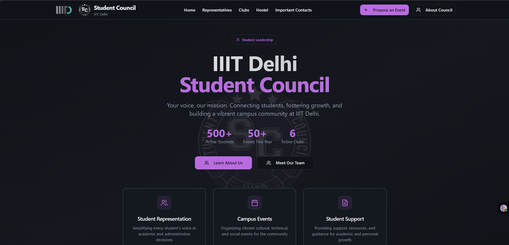
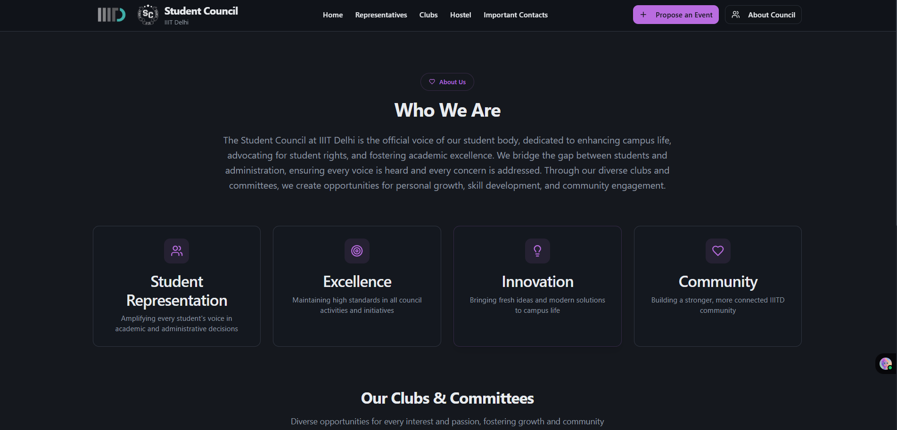
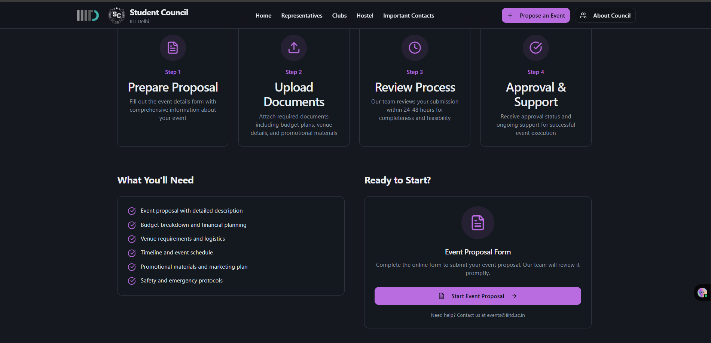
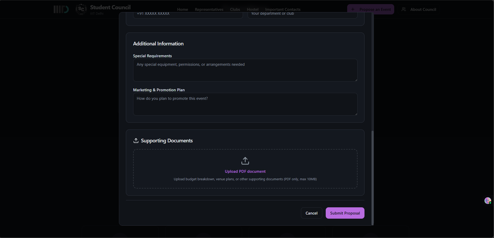

# IIITD Student Council Website 

This is a centralized platform designed for the IIITD - Student Council to manage, discover, and participate in campus events and student club activities. The website serves as a hub for students, faculty, and council members to streamline event proposals, club formation requests, and the overall organization of student-led initiatives.

# **Snapshots**

---
The platform serves as:
- A unified portal for all student council and club-related activities.
- A central repository for event information, club details, and council updates.
- A transparent interface for communication between students, clubs, and council members.
- A digital workspace to streamline student engagement and organizational processes.

The platform enables:
- Submission and review of event proposals by students and clubs.
- Management and discovery of active student clubs, including their coordinators and contact information.
- Transparent display of student council representatives and leadership.
- Access to important guidelines, charters, and documentation relevant to student activities.

**Tech Stack**
- React (with TypeScript) for the frontend
- Supabase for backend database and file storage
- Tailwind CSS and Shadcn UI for styling and UI components
- React Query for data fetching and caching

This project aims to foster a vibrant, well-organized, and transparent student life at IIITD by digitizing and simplifying event and